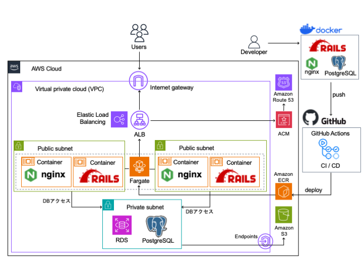
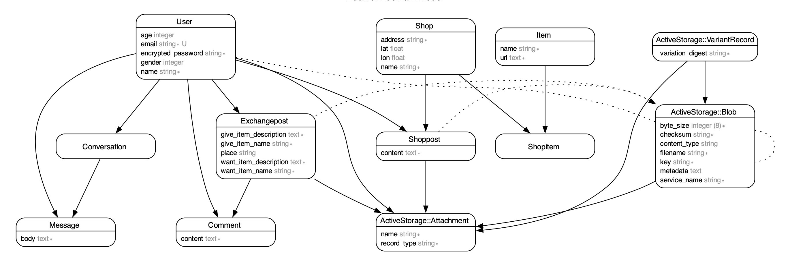
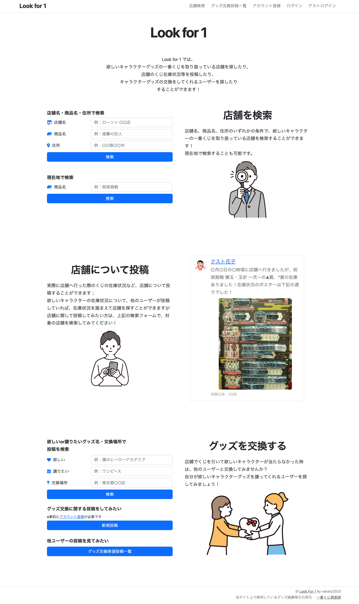
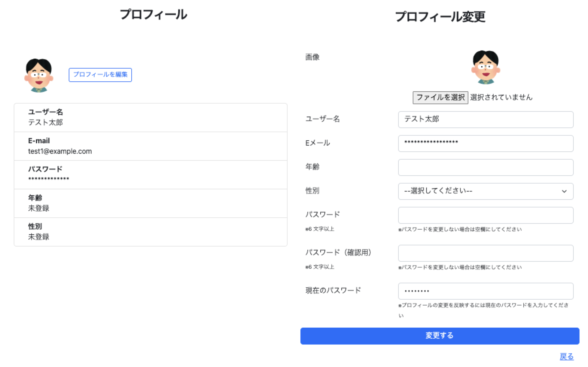
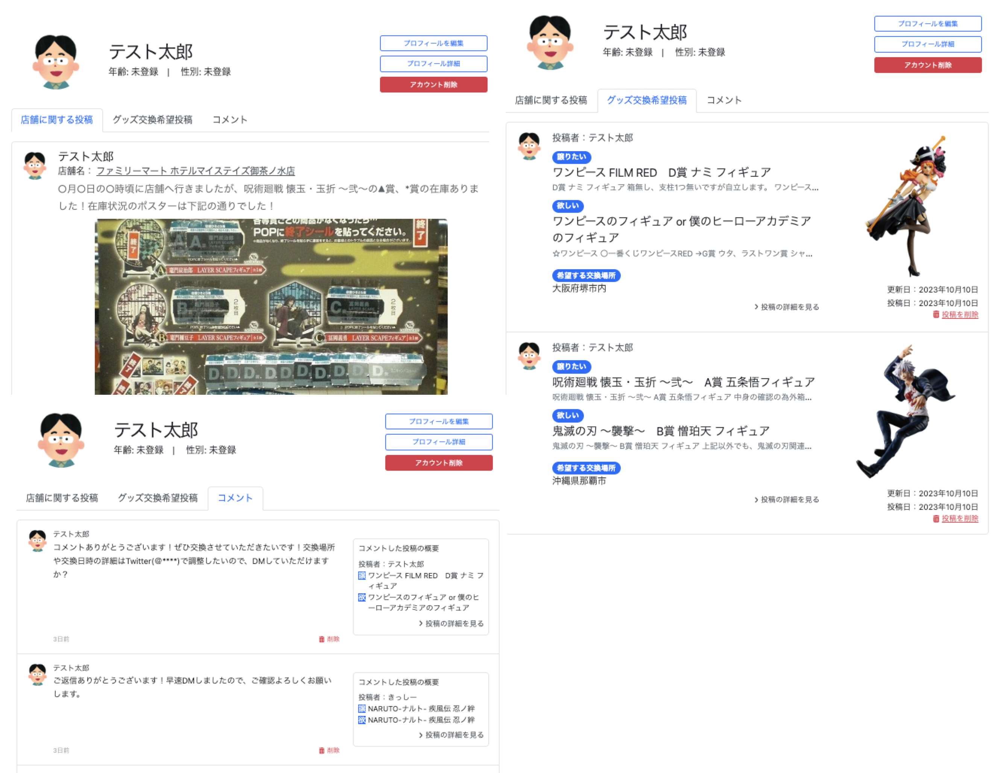
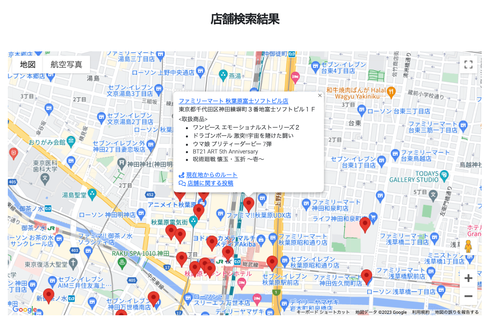
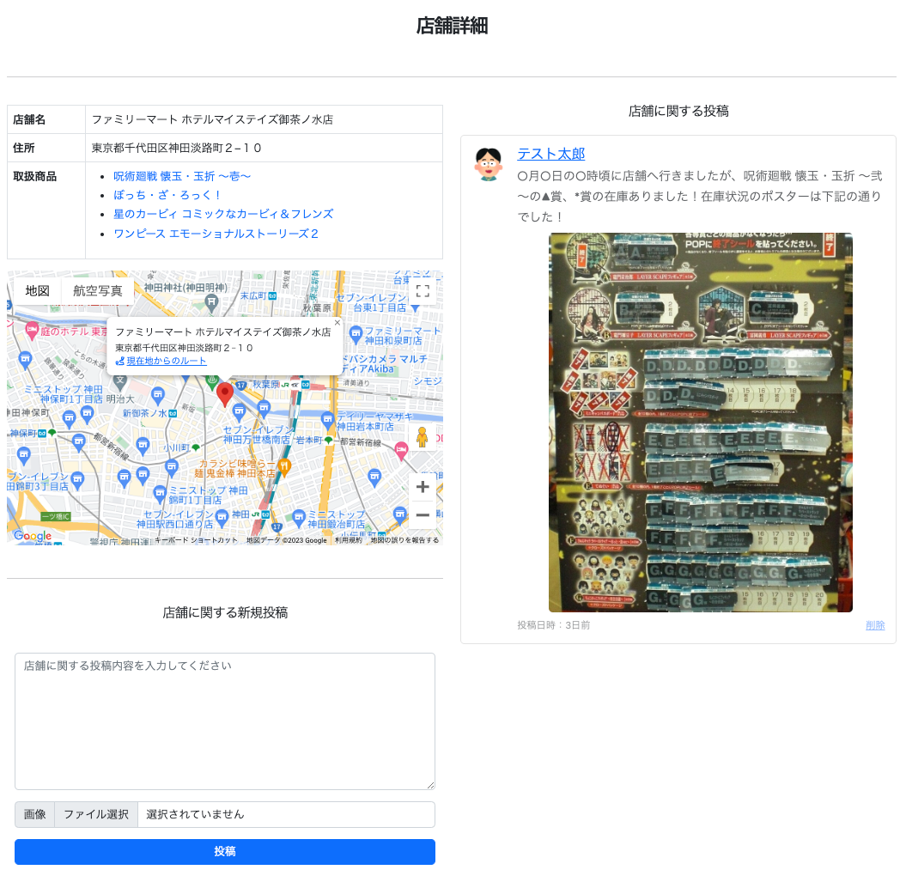
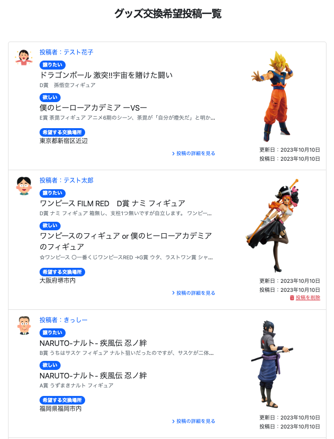
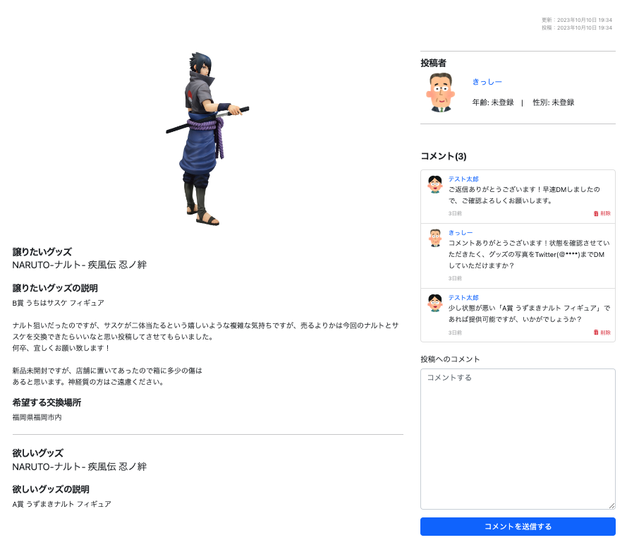

# Look for 1
一番くじが好きなユーザーが、引きたいキャラクターくじを取り扱っている店舗を探したり、くじ取扱店舗に関して情報交換したり、くじで当たったグッズを交換してくれるユーザーを探したりすることができるWebアプリです。

## 目次
- [作成者について](#作成者について)
  - [自己紹介](#自己紹介)
  - [学習中の言語・技術](#学習中の言語・技術)
  - [取り組んできたこと](#取り組んできたこと)
  - [連絡先](#連絡先)
- [アプリについて](#アプリについて)
  - [背景](#背景)
  - [URL](#url)
  - [インフラ構成図](#インフラ構成図)
  - [ER図](#er図)
  - [機能一覧](#機能一覧)
  - [使用画面のイメージ](#使用画面のイメージ)
  - [技術スタック](#技術スタック)
  - [開発フロー](#開発フロー)

 

# 作成者について

## 自己紹介
アプリを作成したnakaty と申します。\
ご覧いただきありがとうございます。\
私は、大学卒業後約10年間、地方公務員として勤務してきましたが、ExelVBAで作成した業務効率化ツールを同僚に喜んでいただけたことをきっかけに、プログラミングへの興味が深まり、専門性を高めてプログラミングを仕事にしたいと思うようになりました。\
私がWebエンジニアになりたい理由は、専門的で高度なスキルにより様々な社会課題を解決できることに魅力を感じるからです。\
Webエンジニアとして働き、スキルを磨くことで、多くの人々に喜んでいただけるようなWebサービスの開発に携わりたいと考えております。

## 学習中の言語・技術
- `Linux`
- `HTML, CSS, JavaScript`
- `SQL(PostgreSQL)`
- `Ruby, Ruby on Rails`
- `Docker`
- `nginx`
- `Git, GitHub, GitHub Actions`
- `AWS`

2023/5/20から学習開始\
2023/10/12までの総学習時間887時間

## 取り組んできたこと
- `Progate（HTML, CSS, JavaScript, Ruby, Ruby on Rails, Git, Command Line, SQL）`\
期間：5/20〜5/30　時間：68H

- `プログラミングスクール「ポテパンキャンプ」（Railsキャリアコース）カリキュラム`\
期間：5/29〜7/8　時間：216H

- `書籍「Everyday Rails - RSpecによるRailsテスト入門」`\
期間：6/5〜6/6　時間：11H

- [Ruby on Rails チュートリアル](https://railstutorial.jp/)\
期間：6/10〜7/20　時間：83H

- `書籍「Linux 標準教科書 (Ver.3.0.4)」`\
期間：7/10〜8/17　時間：21H

- `書籍「Amazon Web Services基礎からのネットワーク＆サーバー構築改訂４版」`\
期間：8/17〜8/20　時間：16H

- [RailsアプリケーションをAWSに自動デプロイする方法を学ぼう！](https://www.techpit.jp/courses/200)\
期間：8/20〜8/24　時間：32H

- [入門 Docker](https://y-ohgi.com/introduction-docker/)\
期間：8/24〜8/25　時間：10H

- [RailsとVue.jsでSPA開発+AWS（Fargate・CloudFront）デプロイ解説チュートリアル](https://zenn.dev/prune/books/c571868574af90)\
期間：8/28〜8/31　時間：17H

- `書籍「Docker/Kubernetes 実践コンテナ開発入門」`\
期間：8/31　時間：5H

- `ポートフォリオ作成`\
期間：7/8〜10/12　時間：404H

※上記は2023/10/12までの記録です。

## 連絡先
- Twitter: [@nakaty2023](https://twitter.com/nakaty2023)

 

# アプリについて

## 背景
転職活動のためのポートフォリオとして、どのようなWebアプリを作成すべきか悩んでいた際、一番くじを購入したことがある友人から、下記内容を聞き取りました。
- 一番くじはコンビニ等で取り扱っているが、全店舗で必ず入荷しているわけではない。また、一番くじを導入している店舗でも、取り扱っているキャラクターはバラバラであり、購入したい一番くじを取り扱っている店舗かどうかは、公式サイトで検索する必要がある。
- 公式サイトで店舗検索すると、購入したい一番くじを取り扱っている店舗情報の一覧が表示されるが、マップ上に一覧表示されないので、どの店舗が行きやすいのかがわかりにくい。
- 店舗検索結果に、各店舗のくじ在庫状況が記載されておらず、在庫状況を確認するためには、店舗へ直接行って確認するか電話確認する必要があり、店舗の店員とくじ購入希望者双方の負担となっている。
- くじを引いても欲しい商品が当たるとは限らず、欲しくない商品を引いた場合、メルカリ等で売ろうにも送料・手数料を考慮すると売りづらい。

上記内容について、下記機能を実装したWebアプリを作成すれば、一番くじが好きな方のニーズに応えることができると考え、一番くじに関するアプリ「Look for 1」をポートフォリオとして作成することにしました。
- 検索条件に該当する店舗一覧とユーザー現在地をGoogleMap上に表示する機能
- GoogleMap上の店舗マーカーをクリックすると、その店舗で取り扱っているキャラクターくじ一覧を表示する機能
- 実際に店舗でくじを引いたユーザーが店舗別のくじ在庫状況等を投稿する機能
- くじで当たったグッズを譲りたい人とそのグッズが欲しい人の現地交換を実現するためのマッチング機能

## URL
Look for 1\
https://lookfor1.site

## インフラ構成図

## ER図

## 機能一覧
- アカウント登録/削除機能
- ログイン/ログアウト機能
- ゲストログイン機能
  - ゲストログインユーザーがプロフィール編集やアカウント削除できないようフィルタを設定
- プロフィール詳細表示/編集機能
  - ログインユーザーが自分の情報のみ表示・編集できるようフィルタを設定
- 店舗検索機能
  - 店舗名・グッズ名・住所・現在地で店舗検索可能
  - ユーザー現在地で検索する際の検索ボタンは、位置情報が取得できた場合のみ有効化
  - 検索条件に該当する店舗一覧をGoogleMap上にマーカーで表示
  - 現在地で検索した場合は、ユーザー現在地もGoogleMap上に表示
  - GoogleMap上のマーカークリックで下記情報を表示
    - 店舗名、店舗住所、店舗別取扱グッズ一覧
    - 現在地で検索した場合、現在地から店舗までのルートを表示するリンク
    - 店舗詳細ページ（店舗に関する投稿一覧ページ）へのリンク
- 店舗詳細表示機能
  - 店舗別取扱グッズ一覧を表示
  - 各グッズ名をクリックして公式サイトのグッズ詳細ページへ遷移可能
- 店舗に関する投稿/削除機能
  - ログインユーザーが自分の投稿のみ削除できるようフィルタを設定
- 店舗別投稿一覧表示機能
  - ユーザーから投稿された店舗に関する投稿を、当該店舗詳細ページで一覧表示
- 店舗情報、グッズ情報、店舗別取扱グッズ情報を公式サイトからスクレイピングで取得・保存する機能\
`※ 2023/10/12時点では、東京都（千代田区、中央区）と沖縄県（那覇市、宜野湾市）の店舗情報のみ取得済です。`
- グッズ交換に関する投稿/削除機能
  - ログインユーザーのみ投稿可能となるようフィルタ設定
  - ログインユーザーが自分の投稿のみ削除できるようフィルタを設定
- グッズ交換に関する投稿詳細表示機能
- グッズ交換希望投稿検索機能
  - 欲しいor譲りたいグッズ名・交換場所で検索可能
- グッズ交換希望投稿一覧表示機能
- グッズ交換に関する投稿へのコメント投稿/削除機能
  - ログインユーザーのみ投稿/削除可能となるようフィルタ設定
- グッズ交換に関する投稿へのコメント一覧表示機能

## 使用画面のイメージ
#### トップページ

#### ユーザープロフィール表示・編集

#### ユーザー別投稿一覧・コメント一覧

#### 店舗検索結果

#### 店舗詳細ページ

#### グッズ交換に関する投稿一覧

#### グッズ交換に関する投稿詳細ページ

## 技術スタック
### プログラミング言語
#### ■ バックエンド
- Ruby 3.1.4

#### ■ フロントエンド
- HTML
- CSS
- JavaScript

### フレームワーク
#### ■ バックエンド
- Ruby on Rails 7.0.4\
主要 gem
  - `devise`：認証機能
  - `nokogiri`：HTMLの構造解析・操作
  - `selenium-webdriver`：ブラウザ操作の自動化
  - `ransack`：検索機能
  - `active_storage_validations`：画像のバリデーション
  - `image_processing`：画像のリサイズ
  - `rspec-rails`：RSpecによるテスト
  - `rubocop`：コード解析・修正
  - `bullet`：N＋1問題の検知
  - `aws-sdk-s3`： Amazon S3のバケット操作等

#### ■ フロントエンド
- Bootstrap

### ミドルウェア
- nginx

### データベース
- PostgreSQL

### インフラ
- AWS
  - `ECS Fargate`: Rails, nginx のコンテナを実行
  - `ECR`: Rails, nginx のコンテナイメージの保存・管理
  - `ALB`: HTTP/HTTPS層のトラフィックを複数コンテナに分散
  - `RDS`: DB エンジンは PostgreSQL を使用
  - `S3`: 画像の保存先
  - `Route53`: 独自ドメインでのアクセス
  - `VPC`: 仮想的なプライベートネットワークを作成
  - `ACM`: SSL/TLS 証明書を発行

### CI/CD
- GitHub Actions

### 環境構築
- Docker
  - 開発環境をコンテナ化\
  （Rails, nginx, PostgreSQL, Selenium）

### コード管理
- GitHub

### API
- Google Maps API
  - `Maps JavaScript API`：Webページにマップを表示

## 開発フロー
- 作業開始時に作業用ブランチをmainブランチから作成
- コードの変更内容をコミットし、GitHubへプッシュ
- プッシュをトリガーとして、GitHub Actionsによる自動テスト（Rubocop, RSpec）を実行
- 全ての作業完了後、プルリクエストを作成
- プルリクエストをトリガーとして、GitHub Actionsによる自動テスト（Rubocop, RSpec）を実行
- テストが成功した場合、他の開発者にコードレビューを依頼して承認されたと仮定し、作業用ブランチをmainブランチへマージ
- mainブランチへのマージをトリガーとして、GitHub ActionsによるAWS（ECS Fargate）への自動デプロイを実行

 
最後までご覧いただきありがとうございました。
