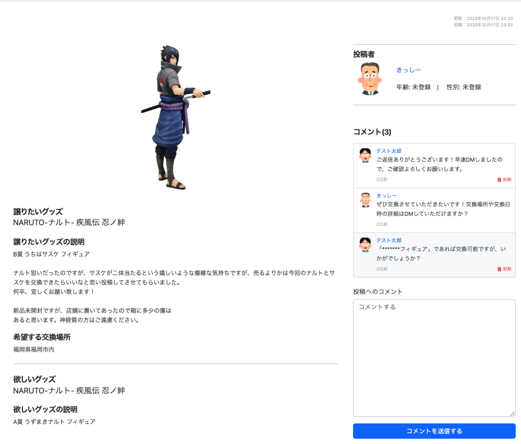
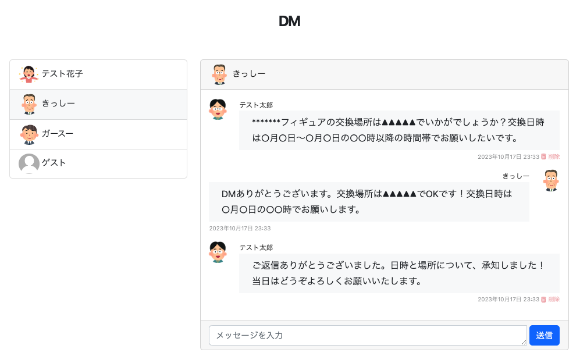

# Look for 1
一番くじが好きなユーザーが、引きたいキャラクターくじを取り扱っている店舗を探したり、くじ取扱店舗に関して情報交換したり、くじで当たったグッズを交換してくれるユーザーを探したりすることができるWebアプリです。

## 目次
- [作成者について](#作成者について)
  - [自己紹介](#自己紹介)
  - [学習中の言語・技術](#学習中の言語・技術)
  - [取り組んできたこと](#取り組んできたこと)
  - [連絡先](#連絡先)
- [アプリについて](#アプリについて)
  - [背景](#背景)
  - [URL](#url)
  - [インフラ構成図](#インフラ構成図)
  - [ER図](#er図)
  - [機能一覧](#機能一覧)
  - [テスト](#テスト)
  - [使用画面のイメージ](#使用画面のイメージ)
  - [技術スタック](#技術スタック)
  - [開発フロー](#開発フロー)

 

# 作成者について

## 自己紹介
アプリを作成したnakaty と申します。\
ご覧いただきありがとうございます。\
私は、大学卒業後非IT業界で働いてきましたが、ExelVBAで業務効率化ツールを作成したことをきっかけに、プログラミングへの興味が深まり、専門性を高めてエンジニアになりたいと考えるようになりました。\
私がWebエンジニアになりたい理由は、専門的で高度なスキルにより様々な社会課題を解決できることに魅力を感じるからです。\
Webエンジニアとして働き、スキルを磨くことで、多くの人々に喜んでいただけるようなWebサービスの開発に携わりたいと考えております。

## 学習中の言語・技術
- Linux
- HTML, CSS, JavaScript
- SQL(PostgreSQL)
- Ruby, Ruby on Rails
- Docker
- nginx
- Git, GitHub, GitHub Actions
- AWS

## 取り組んできたこと
- Progate（HTML, CSS, JavaScript, Ruby, Ruby on Rails, Git, Command Line, SQL）\
期間：5/20〜5/30　時間：68H

- プログラミングスクール「ポテパンキャンプ」（Railsキャリアコース）カリキュラム\
期間：5/29〜7/8　時間：216H

- 書籍「Everyday Rails - RSpecによるRailsテスト入門」\
期間：6/5〜6/6　時間：11H

- [Ruby on Rails チュートリアル](https://railstutorial.jp/)\
期間：6/10〜7/20　時間：83H

- 書籍「Linux 標準教科書 (Ver.3.0.4)」\
期間：7/10〜8/17　時間：21H

- 書籍「Amazon Web Services基礎からのネットワーク＆サーバー構築改訂４版」\
期間：8/17〜8/20　時間：16H

- [RailsアプリケーションをAWSに自動デプロイする方法を学ぼう！](https://www.techpit.jp/courses/200)\
期間：8/20〜8/24　時間：32H

- [入門 Docker](https://y-ohgi.com/introduction-docker/)\
期間：8/24〜8/25　時間：10H

- [RailsとVue.jsでSPA開発+AWS（Fargate・CloudFront）デプロイ解説チュートリアル](https://zenn.dev/prune/books/c571868574af90)\
期間：8/28〜8/31　時間：17H

- 書籍「Docker/Kubernetes 実践コンテナ開発入門」\
期間：8/31　時間：5H

- ポートフォリオアプリ作成\
期間：7/8〜10/12　時間：453H

 
2023/5/20から学習開始 
2023/10/19までの総学習時間　952時間

## 連絡先
twitter: [@nakatyyyyyyy](https://twitter.com/nakatyyyyyyy)

 

# アプリについて

## 背景
転職活動のためのポートフォリオとして、どのようなWebアプリを作成すべきか悩んでいた際、一番くじを購入したことがある友人から、下記内容を聞き取りました。
- 一番くじはコンビニ等で取り扱っているが、全店舗で必ず入荷しているわけではない。また、一番くじを導入している店舗でも、取り扱っているキャラクターはバラバラであり、購入したい一番くじを取り扱っている店舗かどうかは、公式サイトで検索する必要がある。
- 公式サイトで店舗検索すると、購入したい一番くじを取り扱っている店舗情報の一覧が表示されるが、マップ上に一覧表示されないので、どの店舗が行きやすいのかがわかりにくい。
- 店舗検索結果に、各店舗のくじ在庫状況が記載されておらず、在庫状況を確認するためには、店舗へ直接行って確認するか電話確認する必要があり、店舗の店員とくじ購入希望者双方の負担となっている。
- くじを引いても欲しい商品が当たるとは限らず、欲しくない商品を引いた場合、メルカリ等で売ろうにも送料・手数料を考慮すると売りづらい。

上記内容について、下記機能を実装したWebアプリを作成すれば、一番くじが好きな方のニーズに応えることができると考え、一番くじに関するアプリ「Look for 1」をポートフォリオとして作成することにしました。
- 検索条件に該当する店舗一覧とユーザー現在地をGoogleMap上に表示する機能
- GoogleMap上の店舗マーカーをクリックすると、その店舗で取り扱っているキャラクターくじ一覧を表示する機能
- 実際に店舗でくじを引いたユーザーが店舗別のくじ在庫状況等を投稿する機能
- くじで当たったグッズを譲りたい人とそのグッズが欲しい人の現地交換を実現するためのマッチング機能

## URL（※）
Look for 1\
https://lookfor1.onrender.com 
※ 2023/11/30に変更しました。

## インフラ構成図（※）
 
### **※ 2023/11/30にデプロイ先をAWSからRender.comへ変更しました。**

## ER図

## 機能一覧
### ■ ユーザー関連
|  機能  |  説明  |
| ---- | ---- |
|  アカウント登録/削除 |  deviseの機能をカスタマイズ ユーザーの性別情報の保存にenumを利用 ゲストユーザーがアカウント削除できないようフィルタ設定  |
|  ログイン/ログアウト |  deviseの機能をカスタマイズ ゲストログイン機能を実装  |
|  プロフィール編集 |  deviseの機能をカスタマイズ ログインユーザーが自分の情報のみ編集できるようフィルタ設定  |
|  プロフィール表示 |  ログインユーザーが自分の情報のみ表示できるようフィルタ設定  |
|  ユーザー別投稿等一覧表示 | ユーザー別の下記情報を表示 ・店舗に関する投稿一覧 ・グッズ交換に関する投稿一覧 ・グッズ交換に関する投稿へのコメント一覧 ・DM一覧 |

### ■ 店舗関連
|  機能  |  説明  |
| ---- | ---- |
|  店舗検索 |  店舗名・グッズ名・住所・現在地で検索可能 現在地で検索する際の検索ボタンは、ユーザー位置情報が取得できた場合のみ有効化 |
|  店舗検索結果表示 |  検索条件に該当する店舗一覧をGoogleMap上にマーカーで表示 GoogleMap上のマーカークリックで下記を表示 ・店舗名、店舗住所、店舗別取扱グッズ一覧 ・現在地から店舗までのルートを表示するリンク ・店舗に関する投稿一覧ページへのリンクを表示 |
|  店舗詳細表示 |  店舗別取扱グッズ一覧を表示 公式サイトへ遷移するグッズ名のリンクを表示 店舗別投稿一覧を表示 |
|  店舗に関する投稿/削除 |  ログインユーザーが自分の投稿のみ削除できるようフィルタを設定 |
|  スクレイピング | グッズ情報、店舗名、住所、店舗別取扱グッズ情報を公式サイトから取得・保存 ※ 東京都と沖縄県の店舗情報のみ取得済です。(2023/10/19時点) |

### ■ グッズ交換に関する投稿関連
|  機能  |  説明  |
| ---- | ---- |
|  グッズ交換に関する投稿/削除 |  ログインユーザーのみ投稿可能となるようフィルタ設定 ログインユーザーが自分の投稿のみ削除できるようフィルタ設定 |
|  投稿詳細表示 | 欲しいor譲りたいグッズの情報、交換場所等を表示 投稿に関するコメント一覧を表示 |
|  投稿検索/検索結果表示 | 欲しいor譲りたいグッズ名、交換場所で検索可能 検索条件に該当する投稿を一覧表示 |
|  コメント投稿/削除 | ログインユーザーのみコメント投稿/削除可能となるようフィルタ設定 |
|  DM送信/削除 | ログインユーザーのみDM送信/削除可能となるようフィルタ設定 DMのやりとりは参加ユーザー以外が閲覧できないようフィルタ設定 |

## テスト
- RSpec
  - モデルスペック
  - システムスペック
  - リクエストスペック

## 使用画面のイメージ
#### トップページ

#### ユーザープロフィール表示・編集

#### ユーザー別投稿一覧・コメント一覧

#### 店舗検索結果

#### 店舗詳細ページ

#### グッズ交換に関する投稿一覧

#### グッズ交換に関する投稿詳細ページ

#### DMの送信

## 技術スタック
### プログラミング言語
|  カテゴリー  |  使用技術  |
| ---- | ---- |
|  フロントエンド |  HTML, CSS, JavaScript  |
|  バックエンド  |  Ruby 3.1.4  |

### フレームワーク
|  カテゴリー  |  使用技術  |
| ---- | ---- |
|  フロントエンド |  Bootstrap  |
|  バックエンド  |  Ruby on Rails 7.0.4  |

#### ■ Ruby on Rails　主要 gem
|  gem |  説明  |
| ---- | ---- |
|  devise |  認証機能  |
|  nokogiri  |  HTMLの構造解析・操作  |
|  selenium-webdriver  |  ブラウザ操作の自動化  |
|  ransack  |  検索機能  |
|  active_storage_validations  |  画像のバリデーション  |
|  image_processing  |  画像のリサイズ  |
|  rspec-rails  | RSpecによるテスト  |
|  factory_bot_rails  |  RSpecのテストデータ生成  |
|  rubocop  |  コード解析・修正  |
|  bullet  |  N＋1問題の検知  |
|  dotenv-rails  |  環境変数の管理 |
|  rails-erd  |  ER図の生成 |
|  aws-sdk-s3  |  Amazon S3のバケット操作等  |

### その他
|  カテゴリー  |  使用技術  |
| ---- | ---- |
|  ミドルウェア |  nginx  |
|  データベース |  PostgreSQL  |
|  インフラ |  AWS  |
|  CI/CD |  GitHub Actions  |
|  コード管理 |  Git, GitHub  |
|  環境構築 |  Docker ※ 開発環境（Rails, nginx, PostgreSQL, Selenium）をコンテナ化  |
|  API |  Google Maps API（Maps JavaScript API）  |

#### ■ AWS 詳細
|  サービス名  |  説明  |
| ---- | ---- |
|  ECS |  Fargateを利用　Rails, nginx のコンテナを実行  |
|  ECR |  Rails, nginx のコンテナイメージの保存・管理  |
|  ALB |  HTTP/HTTPS層のトラフィックを複数コンテナに分散  |
|  RDS |  DB エンジンは PostgreSQL を使用  |
|  S3 |  画像の保存先  |
|  Route53 |  独自ドメインでのアクセス  |
|  VPC |  仮想的なプライベートネットワークを作成  |
|  ACM |  SSL/TLS 証明書を発行  |

## 開発フロー
- 作業開始時に作業用ブランチをmainブランチから作成
- コードの変更内容をコミットし、GitHubへプッシュ
- プッシュをトリガーとして、GitHub Actionsによる自動テスト（Rubocop, RSpec）を実行
- 全ての作業完了後、プルリクエストを作成
- プルリクエストをトリガーとして、GitHub Actionsによる自動テスト（Rubocop, RSpec）を実行
- テストが成功した場合、他の開発者にコードレビューを依頼して承認されたと仮定し、作業用ブランチをmainブランチへマージ
- mainブランチへのマージをトリガーとして、GitHub ActionsによるAWS（ECS Fargate）への自動デプロイを実行

 
最後までご覧いただきありがとうございました。
